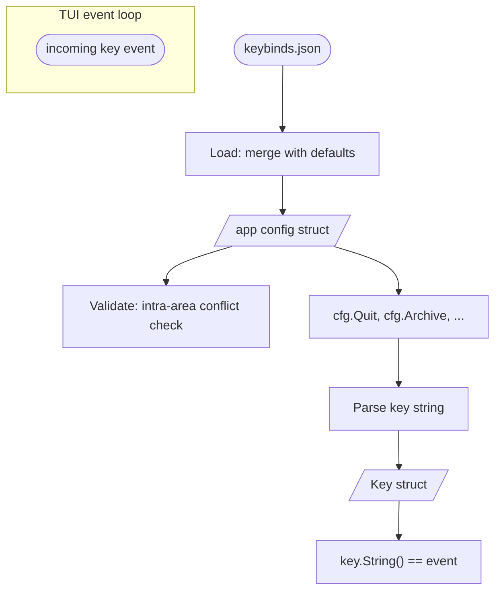

# go-keybind

`go-keybind` provides two focused utilities for Go TUI applications:

1. **`Key` — a parsed, normalized keyboard shortcut.** `Parse` validates a key
   string (catching typos like `"crtl+c"` or `"delte"`), canonicalizes modifier
   order and special-key aliases (`"escape"` → `"esc"`, `"return"` → `"enter"`),
   and produces a comparable value.

2. **A generic JSON keybind-config loader.** `Load`, `Save`, and `Validate` work
   with any app-defined struct — no code generation, no schema files. Missing
   fields in the user's config keep their default values (merge semantics), the
   file is written on first run, and `Validate` catches intra-area conflicts.

It was extracted from [matcha](https://github.com/floatpane/matcha)'s config
package, where it manages keyboard shortcuts for a mail client's inbox, email
view, composer, and folder panels.

## Architecture

## Features

- **Typed `Key`.** Ctrl/Alt/Shift booleans + canonical Base string. Comparable
  with `==` — parse your config strings once at startup, compare with a switch.
- **Alias normalization.** `escape`→`esc`, `return`→`enter`, `del`→`delete`,
  `pageup`→`pgup`, `meta`/`opt`→`alt`, and more. One canonical form regardless
  of what the user typed.
- **Modifier order fixed.** Input order doesn't matter; `String()` always emits
  `ctrl+alt+shift+base`.
- **Generic `Load[T]`.** Bring your own config struct. Works with any
  JSON-marshalable type.
- **Merge semantics.** Fields the user didn't override keep their compiled-in
  defaults, so adding a new binding in a later release doesn't break existing
  configs.
- **Zero dependencies.** Pure stdlib.

## Sister projects

| Project | Role |
|---------|------|
| [floatpane/matcha](https://github.com/floatpane/matcha) | Reference consumer — inbox, email, composer, folder keybinds. |
| [floatpane/go-icalendar](https://github.com/floatpane/go-icalendar) | Sibling extraction — iCalendar parsing and iMIP replies. |

> [!NOTE]
> The import path is `github.com/floatpane/go-keybind` and the package name
> is `keybind`.
